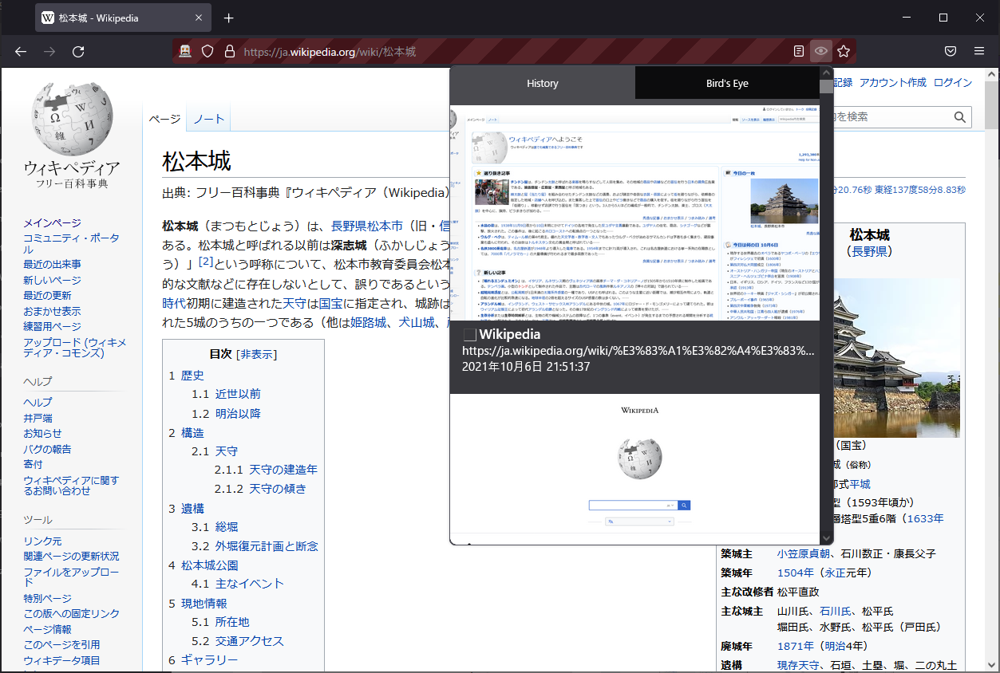

# Third Sight

Browsing history with thumbnails

This FireFox extension adds browser action button to show browsing history with thumbnails




## Some design thoughts

* Since there is no reliable way to get the current session history(not entire browsing history),
  we use `webNavigation.onCompleted` to track navigations.
    * Tabs API don't provide convenient way to navigate the session(only `goBack` and `goForward`),
      so we push a new page with the old url instead of actually go `back`ing to the old page.
      This can be problematic when the request was not sent using `GET` HTTP method.


## Build

```
export NODE_ENV=production

npm install
npm run build

# will generate ./build/out/web-ext-artifacts/third_sight-x.x.x.zip
```


## TODO

* CI
  * Nightly build
* Find type definitions for `browser` variable
  * Polyfills for browser extension
* Settings page
* Write tests
